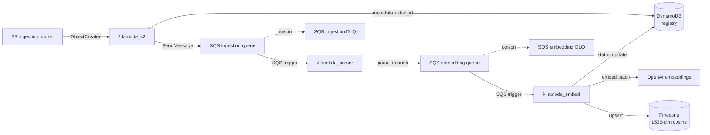
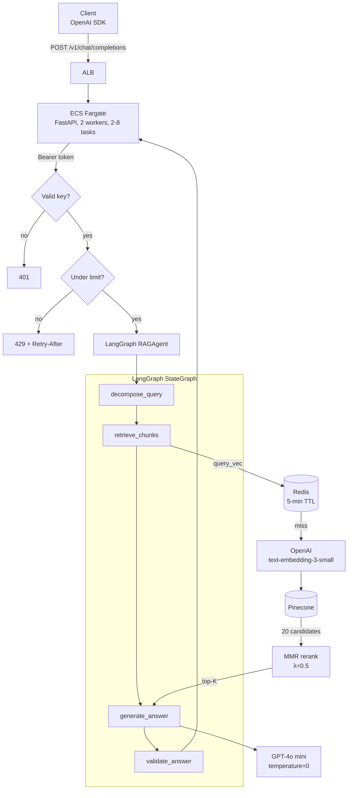

# VecturaFlow — Architecture

This document describes how the system is put together, why it's shaped that way, and how
requests and data flow through it.

---

## 1. System overview

VecturaFlow is split cleanly into two halves:

**Write path (ingestion).** Any upstream drops data into S3 (or posts to a webhook). A chain
of Lambda workers parses → chunks → embeds → upserts into Pinecone, with SQS queues between
each stage so every stage has its own DLQ, concurrency cap, and retry behaviour. DynamoDB
tracks document lifecycle; idempotency is enforced via conditional writes on a `doc_id`
computed from content + source.

**Read path (query).** FastAPI on ECS Fargate accepts OpenAI-compatible requests. A LangGraph
agent decomposes complex queries into sub-queries, retrieves candidate chunks from Pinecone
(with a Redis cache on top), re-ranks for diversity using MMR, generates a grounded answer
with GPT-4o mini, and validates the answer before returning. Every answer includes source
citations with page numbers and a confidence level.

The two halves share nothing at runtime except the Pinecone index and the DynamoDB registry,
so either can be deployed, scaled, or restarted independently.

---

## 2. Write path — ingestion



### Key invariants

- **Every message has an idempotency key.** `doc_id = SHA256(bucket/key/content-length)`.
  DynamoDB writes are conditional on `attribute_not_exists(doc_id)` or on the previous
  lifecycle status, so double-delivery from SQS does not produce duplicate vectors.
- **Chunking preserves metadata.** Each `TextBlock` (a PDF page, a DOCX section, a CSV row
  range) is chunked independently and the chunk carries `page`, `section`, and
  `chunk_index` into Pinecone metadata. Citations back to page numbers require this.
- **Partial-batch SQS responses.** Every Lambda returns `batchItemFailures`, so a single
  unparseable PDF doesn't force the whole batch of 9 other documents back into the queue.
- **DLQs are wired on both queues** with `maxReceiveCount=5`. The DLQs are Terraform-managed
  (not click-opsed) and emit CloudWatch alarms when they receive anything.

---

## 3. Read path — query



### LangGraph state machine

```python
class RAGState(BaseModel):
    query: str
    sub_queries: list[str] = []
    chunks: list[RetrievedChunk] = []
    answer: str = ""
    sources: list[SourceCitation] = []
    confidence: Confidence = Confidence.no_context
    filters: dict | None = None
```

Node by node:

1. **`decompose_query`** — if the query is multi-hop ("What changed between Q2 and Q3?"),
   split it into atomic sub-queries. Simple queries pass through unchanged. Deterministic
   (`temperature=0`).
2. **`retrieve_chunks`** — for each sub-query, call `RetrieverAgent` (Redis-cached,
   exponential-backoff retries, MMR-reranked). Deduplicate by `chunk_id`.
3. **`generate_answer`** — assemble a grounded prompt with the chunks, call GPT-4o mini,
   enforce "answer only from context" instruction.
4. **`validate_answer`** — set `confidence = high` when all retrieved chunks are above the
   score threshold, `low` when the retriever fell back, `no_context` when nothing was
   retrieved. The last case returns a polite "I don't have that in my knowledge base."

### Retriever details

- Over-fetches 20 candidates from Pinecone with `include_values=True`.
- MMR reranks with λ=0.5 so near-duplicate chunks don't dominate the top-K.
- Score threshold (`retrieval_score_threshold`, default 0.70) gates the high-confidence
  path; below the threshold we still return the top 3 with `low_confidence=True`.
- Results are cached in Redis under `vf:retriever:<md5>` for 5 minutes. Redis failure is
  always non-fatal — the code falls through to a live Pinecone query.

---

## 4. Data model

### Pinecone index

| Property  | Value                             |
|-----------|-----------------------------------|
| Name      | `vecturaflow`                     |
| Dimension | 1536 (`text-embedding-3-small`)   |
| Metric    | cosine                            |
| Cloud     | AWS `us-east-1` (serverless)      |

Metadata attached to every vector:

```
doc_id        string   SHA256(bucket/key)
source        string   original S3 key or webhook source
text          string   chunk content (truncated to 500 chars for compact metadata)
chunk_index   number   global chunk position within the document
file_type     string   pdf | docx | csv | txt | json
page          number   PDF page number (when available)
section       string   DOCX heading / section (when available)
```

### DynamoDB tables

**`vecturaflow-registry`**

| Attribute       | Type | Notes                                               |
|-----------------|------|-----------------------------------------------------|
| `doc_id` (PK)   | S    | SHA256 of source content                            |
| `source`        | S    | S3 key or webhook source identifier                 |
| `status`        | S    | `ingestion_started` \| `chunked` \| `embedded` \| `empty_file` \| `parse_failed` |
| `ingested_at`   | S    | ISO-8601 timestamp                                  |
| `chunk_count`   | N    | populated after chunking completes                  |
| `file_type`     | S    | pdf / docx / csv / txt / json                       |

**GSI `status-ingested_at-index`** — always use this for status filtering. Never `Scan`.

**`vecturaflow-keys-v2`**

| Attribute     | Type | Notes                                        |
|---------------|------|----------------------------------------------|
| `api_key_hash` (PK)| S | SHA-256 hash of the bearer token           |
| `key_id`      | S    | stable identifier used in metrics and logs  |
| `owner`       | S    | contact email                                |
| `revoked`     | BOOL | if true, auth fails with 401                 |

---

## 5. Failure modes and what happens

| Failure                                 | Behaviour                                                                                     |
|-----------------------------------------|-----------------------------------------------------------------------------------------------|
| OpenAI API transient error              | 3 retries with `0.5s * 2^(n-1)` backoff; final failure surfaces as 503 to the caller.        |
| Pinecone transient error                | 2 retries with backoff; final failure returns an empty retrieval, `confidence=no_context`.   |
| Redis unavailable                       | Logged at INFO, retriever skips cache and queries Pinecone live.                              |
| DynamoDB auth read failure              | Returns 503 to the caller — we fail closed.                                                   |
| Rate limit exceeded                     | 429 with `Retry-After: 30`. Limiter is per-process; a follow-up ticket moves it to Redis.     |
| Poison message in ingestion queue       | Delivered to the ingestion DLQ after 5 receives; CloudWatch alarm fires.                      |
| Lambda hot-start latency                | AWS clients and OpenAI/Pinecone clients are module-level `@lru_cache(maxsize=1)` singletons. |
| Container OOM under load                | ECS deployment circuit-breaker rolls back; autoscaling target is 60% CPU to leave headroom.   |

---

## 6. Deployment topology

- **VPC** — two public subnets (ALB), two private subnets (Fargate tasks + Lambdas). Single
  NAT for outbound.
- **ALB** — HTTPS on 443 with an ACM certificate. HTTP on 80 redirects.
- **ECS Fargate** — 1 vCPU / 2 GB per task, min 2 tasks, max 8, target-tracking on 60% CPU.
  Deployment circuit-breaker with automatic rollback.
- **ECR** — immutable tags, lifecycle policy keeps the last 20 images.
- **Secrets** — pulled from Secrets Manager at task start via the execution role. No long-lived
  env vars on the task.
- **CloudWatch** — one log group per service, 30-day retention, Container Insights on.
- **IAM** — execution role only has ECR pull + log write + Secrets Manager read. Task role has
  Pinecone-less permissions (DynamoDB, SQS send, S3 get on the ingestion bucket).

All of the above lives in [`infra/terraform/main.tf`](../infra/terraform/main.tf) — there is
no clicked-in infrastructure.

---

## 7. What's deliberately *not* here

- **Per-tenant isolation.** Current design trusts the bearer key and shares one Pinecone
  namespace. Multi-tenant would add a `namespace` axis and a per-key quota.
- **Streaming responses.** The OpenAI SDK supports SSE; the API currently returns the full
  response. Streaming the generator via `StreamingResponse` is a tracked follow-up.
- **Hybrid search.** Pure-vector retrieval only. Adding BM25 + reciprocal-rank-fusion is
  the natural next step for recall on keyword-heavy queries.
- **Cross-process rate limits.** The in-process token bucket is honest about this in the
  module docstring — swap `api/rate_limit.py` for an ElastiCache-backed implementation.
